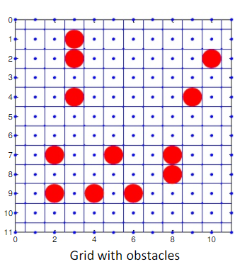
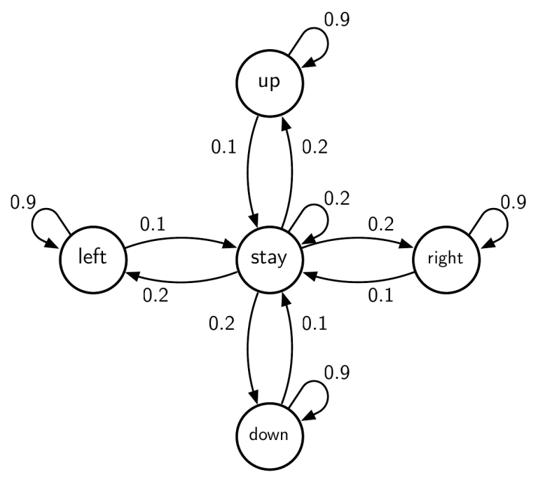
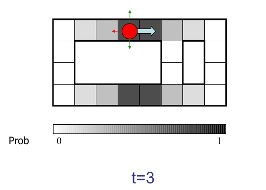

# Robot Localization with Hidden Markov Models using Viterbi's Algorithm 

#Description

Consider a global localization problem in robotics. A robot moves in a grid world shown, and its task is to
determine its location at any given time. Each shaded square of the grid denotes
possible location for the robot (squares correspond to states). The robot’s four
sensors <North, South, West, East> can perceive an obstacle in either of the four
directions. For example, evidence e = NW tells us that North and West have obstacles. We represent this with
a 4-bit binary number 1010, where 1 represents an obstacle and 0 absence of an obstacle for each of the four
directions in the given order <NSWE>

# State Transition Diagram of HMM

#Determining Robot's Location from Estimation Probability

